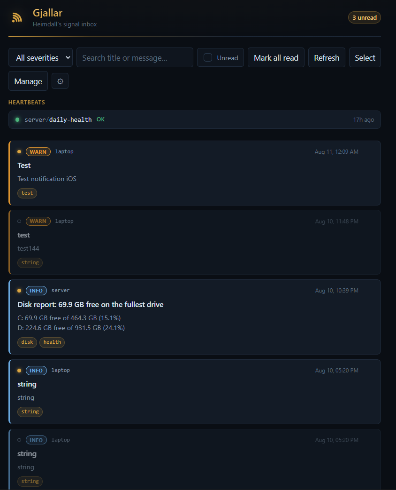
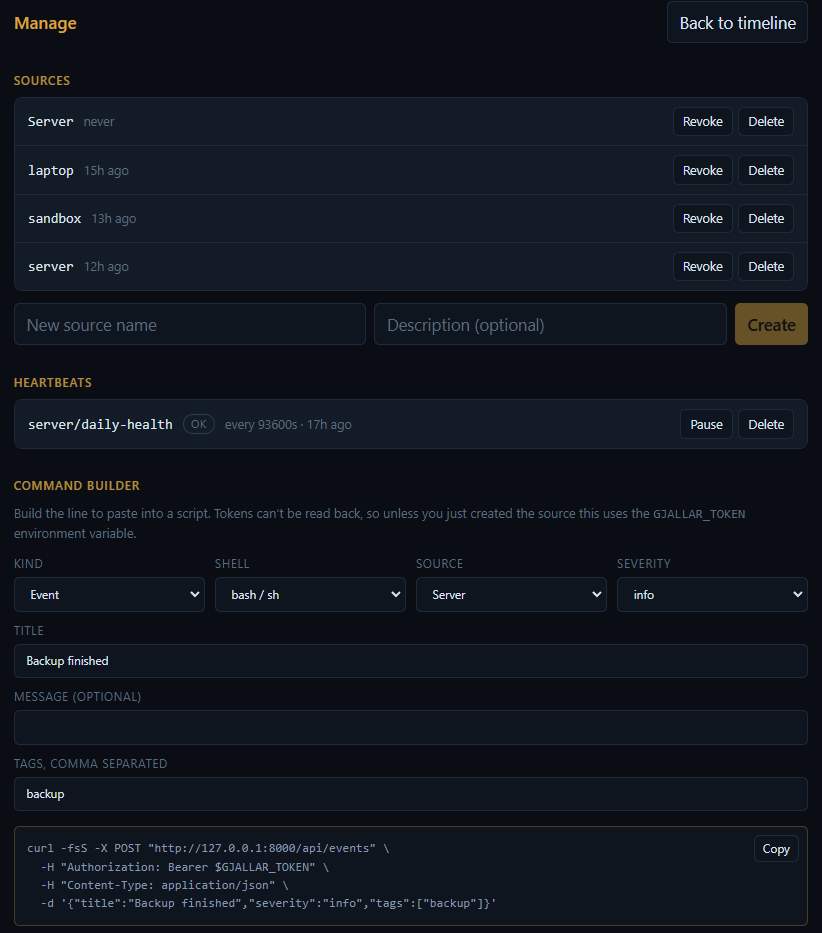

# Gjallar ; Heimdall's Signal Inbox

[](https://github.com/0xheimdall0/Gjallar/actions/workflows/ci.yml)

A self-hosted inbox for machine signals. Any script, cron job or service sends a
one-line HTTP request and the event lands in a searchable timeline on your phone
and desktop. Built with **FastAPI** and **SQLite** on the back, an installable
**Svelte PWA** on the front, and secured with **Argon2**-hashed API tokens.

Unlike ordinary alerting, Gjallar also watches for **silence**: register a
heartbeat for a source, and if the expected ping never arrives, that absence
becomes an alert. It catches the backup script that died six weeks ago and never
said a word.

```bash
curl -H "Authorization: Bearer $TOKEN" \
     -H "Content-Type: application/json" \
     -d '{"title":"Backup finished","severity":"info","message":"412 GB, 3m21s"}' \
     https://gjallar.example.com/api/events
```

> ⚠️ **Disclaimer:** Gjallar is a personal/learning project, still in
> development. It has **not** been independently security-audited. Do not expose
> it to the internet without TLS in front of it, and treat the tokens it issues
> as real credentials.

Named after Gjallarhorn, the horn Heimdall sounds when something is coming.

---

## What's built

- Four-table SQLite schema with constraints, cascades and partial indexes
- Source token authentication: Argon2 hashes, prefix lookup, revocation
- Event ingest with schema validation, rate limiting and a payload cap
- Read API with filters, tag and text search, and cursor pagination
- Svelte timeline UI: read/unread tracking, selection, bulk delete
- Installable PWA with Web Push, and per-device severity thresholds
- Heartbeats: ping endpoint, silence checker, one alert per outage
- First-run setup wizard and a management view with a command builder
- Security hardening pass, documented in [docs/security-notes.md](docs/security-notes.md)
- Docker image, built and smoke-tested in CI on every push

Known limitations are listed in the
[security notes](docs/security-notes.md#open-weaknesses) rather than glossed
over.

## Features

- **One-line ingest**: any script that can run `curl` can report to Gjallar. No client library, no SDK, no agent to install.
- **Timeline**: every event from every machine in one place, newest first, with severity, source, tags and free-text message.
- **Filtering & search**: by source, by severity, by tag, by full-text match on title or message, or unread only.
- **First-run wizard**: open a fresh install and it provisions its own admin token and push keys, creates your first source, and hands you a working command. No editing config files to get started.
- **Management view**: create, revoke and delete sources; pause or delete heartbeats; and a **command builder** that writes the exact `curl` or PowerShell line for your server, shell and severity.
- **Read/unread tracking**: click an event to mark it read; read entries recede and the unread count sits in the header. Deliberate rather than automatic: scrolling past an alert is not the same as having dealt with it. Select several at once to delete in bulk.
- **Cursor pagination**: pages are requested by last-seen id, so events arriving mid-scroll are never silently skipped.
- **Installable PWA**: add it to your phone's home screen or your desktop; it opens in its own window and works offline for anything already loaded.
- **Web Push notifications**: events reach you with the app closed. Each device sets its own severity floor, so the phone can stay quiet while the desktop shows everything, and `critical` alerts stay on screen until acknowledged.
- **Heartbeats**: declare that a source must check in every *N* seconds with a grace period. A checker runs every minute looking for pings that didn't happen; crossing the grace boundary files a `critical` event, which then flows through the timeline and notifications like any other. Recovery is reported too, and one outage produces exactly one alert.
- **Two credential types**
  - *Source tokens*: write-only, one per machine or script, individually revocable.
  - *Admin token*: read-only, used by the UI.
- **Admin CLI**: create, list and revoke sources without touching the database.
- **Single container**: FastAPI serves both the API and the built frontend. One SQLite file, no Redis, no message queue.
- **Checked on every push**: CI lints the backend, builds the frontend, builds the image, and drives a fresh container through setup, ingest and a heartbeat before calling it green.

## Security model

- **Tokens are never stored.** Only an Argon2id hash is kept; the first 12 characters are stored in the clear as an indexed lookup key, which is not sufficient to authenticate.
- **Unknown tokens cost the same as wrong ones.** A prefix that matches nothing is still verified against a dummy hash, so response timing does not reveal which prefixes exist.
- **Write and read credentials are separate.** A compromised backup script cannot read your timeline; a compromised browser session cannot forge events.
- **Event identity comes from the token**, never from the request body. A source cannot file events as another source.
- **Every query uses bound parameters.** Dynamic `WHERE` clauses are assembled only from string literals in the source; user values always go through placeholders.
- **Output is escaped by default.** Event text is attacker-controlled and rendered in a browser; Svelte interpolation escapes it, and `{@html}` is never used.
- **Tokens are shown once and cannot be recovered.** Lose one, revoke it and issue another.
- **Push payloads are encrypted for the device.** Web Push encrypts the body with keys the browser generated, so the push service relays ciphertext it cannot read. It still sees timing, size and endpoint, so payloads carry a short preview rather than full event text.
- **Dead push endpoints are pruned.** A `404`/`410` from the push service deletes the subscription; repeated other failures retire it after five attempts.

Full threat model, decisions taken and known open weaknesses:
[docs/security-notes.md](docs/security-notes.md).

## Requirements

- **Python 3.11+** (the backend uses `datetime.UTC`) and **Node 18+**.
- Nothing else. No database server, no cache, no broker.

## Quick start

Nothing to configure by hand. The first-run wizard provisions everything.

```bash
git clone https://github.com/0xheimdall0/Gjallar.git
cd Gjallar
```

**Backend**, from `backend/`:

```bash
python -m venv .venv
.venv\Scripts\Activate.ps1        # Windows
# source .venv/bin/activate       # macOS / Linux

pip install -r requirements.txt
uvicorn app.main:app --port 8000
```

**Frontend**, from `frontend/`:

```bash
npm install
npm run build      # the backend serves the result at http://127.0.0.1:8000
```

Then open <http://127.0.0.1:8000> and the wizard takes over:

1. **Set up this instance**: generates the admin token and the VAPID key pair
   for push, and writes them to `backend/.env`.
2. **Save the admin token**: shown once, and already stored in this browser.
3. **Name your first source**: you get its token and a ready-made `curl`.
4. **Enable notifications**: if this device can receive them.

Setup only works while the instance is unclaimed, and only from the machine it
runs on. See [the security notes](docs/security-notes.md#claim-on-first-use)
for the reasoning.

While working on the frontend, run `npm run dev` instead and use
<http://localhost:5173> ; Vite proxies `/api/*` to the backend, so the browser
still sees a single origin and no CORS configuration is needed.

### Doing it by hand instead

The wizard is a convenience; everything it does can be done directly.

```bash
# admin token for the interface
python -c "import secrets; print(secrets.token_urlsafe(32))"

# key pair that signs push messages
python generate_vapid.py
```

Put those in `backend/.env` (copy `.env.example`) as `SIGNAL_ADMIN_TOKEN`,
`SIGNAL_VAPID_PRIVATE_KEY`, `SIGNAL_VAPID_PUBLIC_KEY` and a contact address in
`SIGNAL_VAPID_SUBJECT`.

Generate the VAPID pair **once**. Regenerating it invalidates every existing
subscription, because a browser binds its subscription to the public key that
created it, and every device then has to re-enable notifications.

Sources can be managed from the command line as well as from the interface:

```bash
python manage.py create-source nas "Home NAS"
python manage.py list-sources
python manage.py revoke-source nas
```

## Running it for real

In production there is one process: FastAPI serves the API *and* the built PWA,
so there is no proxy and no second server.

```bash
cd frontend && npm run build      # writes frontend/dist
cd ../backend && uvicorn app.main:app --port 8000
```

Then <http://127.0.0.1:8000> is the whole application.

### With Docker

```bash
docker compose up --build
```

The image is built and smoke-tested on every push by
[CI](.github/workflows/ci.yml): the container is started from a clean checkout,
polled until healthy, then driven through setup, source creation, event ingest
and a heartbeat ping. The badge at the top of this file reflects the last run.

A two-stage build: Node compiles the frontend, and the runtime image copies only
the output, so the shipped container has no Node toolchain in it. The database
lives on a named volume, the process runs as an unprivileged user, and the port
is bound to loopback rather than published to the network.

### Reaching it from your phone

Notifications require a **secure context**. `localhost` qualifies; a LAN address
over plain HTTP does not, so a service worker won't even register. On iOS the
app must additionally be installed to the home screen before Safari will deliver
push at all.

The simplest way to satisfy both without exposing anything publicly is
[Tailscale](https://tailscale.com), which issues a real certificate for your
tailnet:

```bash
tailscale serve --bg --https=443 http://127.0.0.1:8000
tailscale serve status
```

Open the printed `https://…ts.net` URL on your phone, install it to the home
screen, launch it from there, and enable notifications. Only devices on your
tailnet can reach it, and the app never listens on a public interface.

Use `tailscale serve --https=443 off` to stop. Do **not** use `tailscale funnel`
for this. That publishes to the open internet.

## Reporting from your machines

### The mental model

There are **two kinds of credential**, and mixing them up is the usual first
stumble:

| | Who holds it | What it can do |
|---|---|---|
| **Source token** (`sig_…`) | machines and scripts | file events, ping heartbeats |
| **Admin token** | the web interface | read the timeline, manage sources |

One source token per machine, so any of them can be revoked alone. Create them
in the setup wizard, or with `python manage.py create-source <name>`. Each is
shown **once**.

There are **two things a script can send**:

- An **event**: "this happened". Appears in the timeline, may notify you.
- A **ping**: "I'm still alive". Doesn't appear in the timeline; its *absence*
  is what raises an alert.

Most scheduled jobs should send both: an event describing what happened, and a
ping so silence is noticed if the job stops running entirely.

**Heartbeats register themselves.** The first ping must carry
`expected_interval_seconds`, and that call creates the heartbeat. Later pings
can send an empty body, or supply the interval again to change it. There is no
separate "create heartbeat" step.

### The easy way

`scripts/` contains a small client for each platform so you don't have to hand-
write `curl`.

**Linux and macOS**: set two variables once, in `~/.profile`:

```bash
export GJALLAR_URL=https://gjallar.example.com
export GJALLAR_TOKEN=sig_your_source_token
```

then from any script:

```bash
gjallar.sh event "Backup finished" -m "412 GB in 3m21s" -s info -t backup
gjallar.sh ping nightly-backup --every 86400 --grace 3600
```

**Windows**: set the same two variables once:

```powershell
[Environment]::SetEnvironmentVariable('GJALLAR_URL',   'https://gjallar.example.com', 'User')
[Environment]::SetEnvironmentVariable('GJALLAR_TOKEN', 'sig_your_source_token',       'User')
```

then in any script:

```powershell
Import-Module "$HOME\Gjallar\scripts\Gjallar.psm1"

Send-GjallarEvent -Title "Backup finished" -Message "412 GB" -Severity info -Tags backup
Send-GjallarPing  -Name nightly-backup -Every 86400 -Grace 3600
```

Neither client throws. If Gjallar is unreachable they warn and carry on, so
reporting can never break the job doing the reporting. The missing ping is what
tells you something went wrong.

### A complete example

A nightly backup that reports its result and is watched for silence:

```bash
#!/usr/bin/env bash
set -euo pipefail

if restic backup /home > /tmp/backup.log 2>&1; then
    gjallar.sh event "Backup finished" -s info -t backup -m "$(tail -3 /tmp/backup.log)"
else
    gjallar.sh event "Backup FAILED" -s error -t backup -m "$(tail -20 /tmp/backup.log)"
fi

# 26 hours, so a job that runs a little late isn't an outage.
gjallar.sh ping nightly-backup --every 93600 --grace 3600
```

The ping is outside the `if` on purpose: it means "this script ran", not "the
backup worked". Those are different facts, and you want to know about both
independently.

### Without any client

Everything is plain HTTP, so `curl` works from anywhere:

```bash
curl -H "Authorization: Bearer $TOKEN" -H "Content-Type: application/json" \
     -d '{"title":"Disk almost full","severity":"warn","tags":["disk"]}' \
     https://gjallar.example.com/api/events

curl -H "Authorization: Bearer $TOKEN" -H "Content-Type: application/json" \
     -d '{"expected_interval_seconds":3600}' \
     https://gjallar.example.com/api/heartbeats/hourly-sync/ping
```

## API

| Method | Path | Auth | Purpose |
|---|---|---|---|
| `GET` | `/api/health` | none | liveness check; touches the database |
| `GET` | `/api/setup/status` | none | whether this instance is configured |
| `POST` | `/api/setup/claim` | none, once | provision admin token and push keys |
| `POST` | `/api/events` | source token | file an event |
| `GET` | `/api/events` | admin token | timeline, filters, pagination |
| `POST` | `/api/events/{id}/read` | admin token | mark one event read (`?read=false` to undo) |
| `POST` | `/api/events/read-all` | admin token | mark every unread event read |
| `DELETE` | `/api/events/{id}` | admin token | delete one event |
| `POST` | `/api/events/delete` | admin token | delete many, `{"ids": [...]}`, max 500 |
| `POST` | `/api/heartbeats/{name}/ping` | source token | check in; registers the heartbeat on first ping |
| `GET` | `/api/heartbeats` | admin token | all heartbeats and their current state |
| `POST` | `/api/heartbeats/{id}/pause` | admin token | suspend silence checking (`?paused=false` to resume) |
| `DELETE` | `/api/heartbeats/{id}` | admin token | stop watching a heartbeat |
| `GET` | `/api/sources` | admin token | list sources |
| `POST` | `/api/sources` | admin token | create a source; returns its token once |
| `POST` | `/api/sources/{id}/revoke` | admin token | disable the token, keep the history |
| `DELETE` | `/api/sources/{id}` | admin token | delete the source **and everything it sent** |
| `GET` | `/api/push/key` | admin token | VAPID public key for subscribing |
| `POST` | `/api/push/subscribe` | admin token | register this device for notifications |

A heartbeat's first ping must carry `expected_interval_seconds` to register it;
`grace_seconds` is optional and defaults to 300. Later pings can send an empty
body, or supply new values to change the schedule.

Sources and heartbeats are addressed by **id**, not by name. Names may contain
spaces and punctuation, which would need escaping in a URL path.

`POST /api/setup/claim` works only while the instance is unconfigured, and only
for loopback clients unless `SIGNAL_SETUP_ALLOW_REMOTE=true`. Once an admin
token exists it returns `409` permanently.

`POST /api/events` accepts `title` (required), `message`, `severity`
(`debug` / `info` / `warn` / `error` / `critical`), `tags`, `metadata` and `link`.

`GET /api/events` accepts `limit`, `before`, `source`, `severity`, `tag`, `q`
and `unread`.

## Preview

### Timeline
Severity as colour, sources in monospace, unread marked in gold, and the
heartbeat panel above everything so silence is the first thing you see.



### Management and command builder
Create and revoke sources, pause or delete heartbeats, and generate the exact
line to paste into a script for your server, your shell, your severity.



### Notification on a phone, app closed


## Usage

1. Start it, open it, and follow the setup wizard.
2. In **Manage**, create a source for each machine you want to hear from.
3. Use the **command builder** there to produce the exact line for that machine,
   and paste it into whatever script should report.
4. Add a heartbeat ping to anything that runs on a schedule, so that the job
   disappearing is itself an alert.
5. Click **Enable notifications** on each device that should be interrupted.
6. Filter by severity, source or tag when something needs finding; click an
   event to mark it read, or **Select** several to delete at once.

## Troubleshooting

**Notifications never arrive.** Check, in this order:

1. **Operating-system focus modes.** Windows Focus Assist / Do Not Disturb
   suppresses notifications silently. The push service still returns `201`,
   because `201` means *accepted for delivery*, not *displayed*. This is the
   single most likely cause and the easiest to overlook.
2. **The push service is reachable.** Push is the one part of Gjallar you cannot
   self-host: the message travels via Google (Chrome and other Chromium
   browsers), Mozilla (Firefox) or Apple (Safari). Some corporate and campus
   networks block those endpoints, and the failure surfaces as
   `Registration failed - push service error` at subscribe time. Try a different
   browser or network to confirm.
3. **Brave blocks push by default.** Brave ships with Google's push service
   disabled as a privacy measure, so subscription fails outright. Enable it at
   `brave://settings/privacy` → *Use Google services for push messaging*, then
   restart the browser. Note the tradeoff this asks of the user: it opens a
   connection to Google's infrastructure, which then sees push metadata for
   every subscribed site. Someone self-hosting a monitoring tool to avoid third
   parties may reasonably decline. A real limitation of Web Push, not of this
   application.
4. **The subscription is current.** Unregistering the service worker or clearing
   site data invalidates the subscription; re-enable notifications to create a
   new one. Stale rows are pruned when the push service reports them gone.

**Push works on desktop but not on the phone.** Notifications require a secure
context. `localhost` counts; a LAN IP over plain HTTP does not. Serve the app
over HTTPS. On iOS, the app must additionally be installed to the home screen.
Safari does not deliver push to a normal tab.

**Code changes to the service worker don't take effect.** A service worker with
an open client is replaced only after every tab for that origin closes. During
development, unregister it (`about:debugging` in Firefox, DevTools → Application
in Chrome) and hard-reload.

## Architecture

```
scripts / servers ──POST──> FastAPI ──> SQLite
                               │
                               ├─> Web Push ──> phone / desktop
                               └─> Svelte PWA (timeline)

             scheduler ──> heartbeat checker (looks for silence)
```

```
backend/
  app/
    config.py     environment-driven settings, loaded once
    db.py         SQLite connections and helpers
    schema.sql    the whole data model, idempotent DDL
    auth.py       token generation and verification
    push.py       Web Push delivery and subscription pruning
    heartbeats.py silence checker and heartbeat alerting
    models.py     request/response schemas
    main.py       FastAPI application and routes
  manage.py       admin CLI
  generate_vapid.py  one-shot VAPID key generator
  vapid.py        push key generation, shared by CLI and setup endpoint
frontend/
  src/
    App.svelte    timeline, filters, selection
    sw.js         service worker: precache, push, notification click
    lib/
      api.js      the only module that talks to the backend
      push.js     permission prompt and subscription registration
      Setup.svelte      first-run wizard
      Manage.svelte     sources, heartbeats, command builder
      Header.svelte
      EventCard.svelte
      HeartbeatPanel.svelte
scripts/
  gjallar.sh      client for Linux and macOS
  Gjallar.psm1    client for PowerShell
  gjallar-health.ps1  example: daily disk report with a heartbeat
docs/             notes and write-ups
.github/
  workflows/
    ci.yml        lint, frontend build, image build, container smoke test
ruff.toml         lint configuration, including FastAPI exemptions
```

## Files created

- `backend/data/signal.db`: the SQLite database (plus its `-wal` and `-shm` sidecars).
- `backend/.env`: local configuration, including the admin token.

Both are git-ignored.

## License

Released under the [MIT License](LICENSE).
